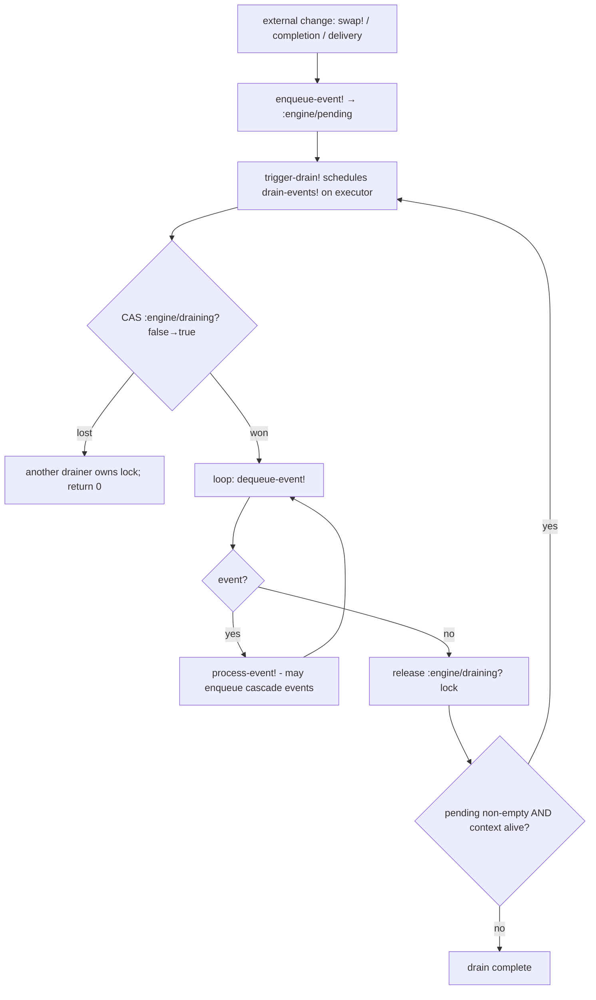
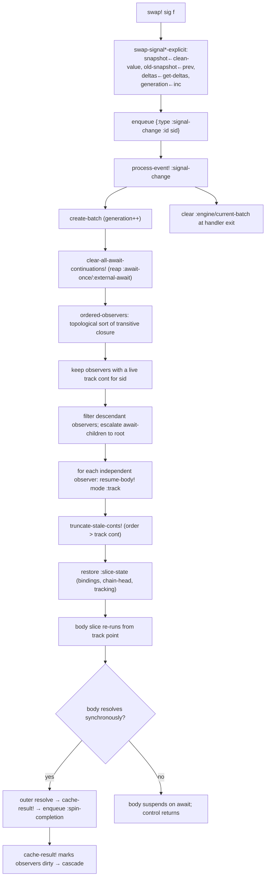
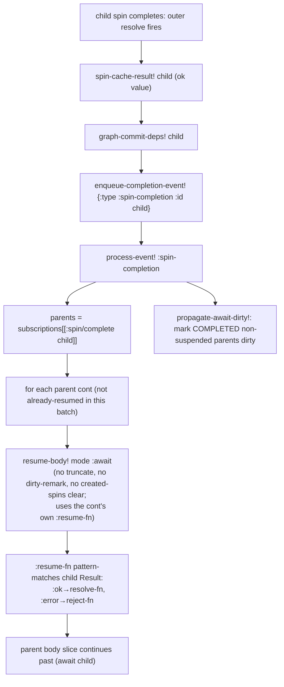
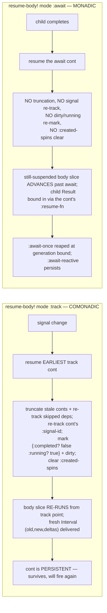
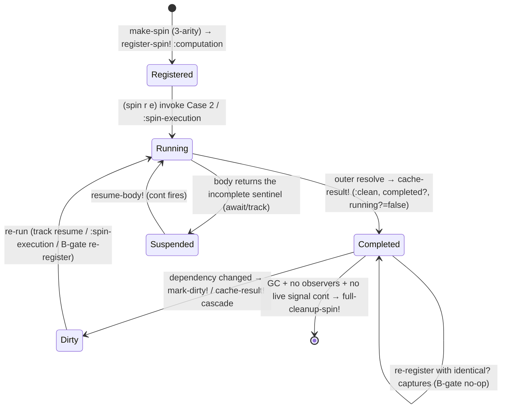
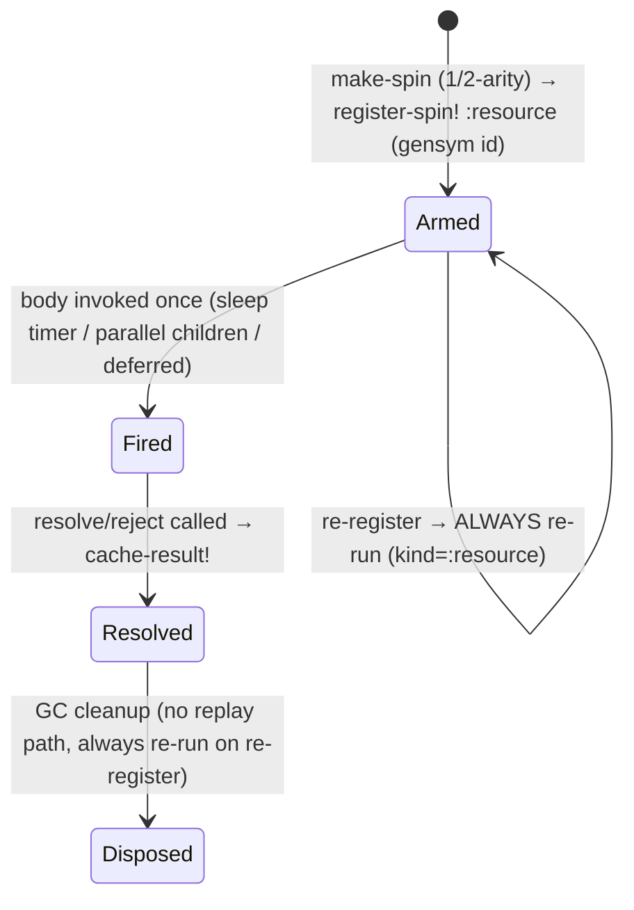
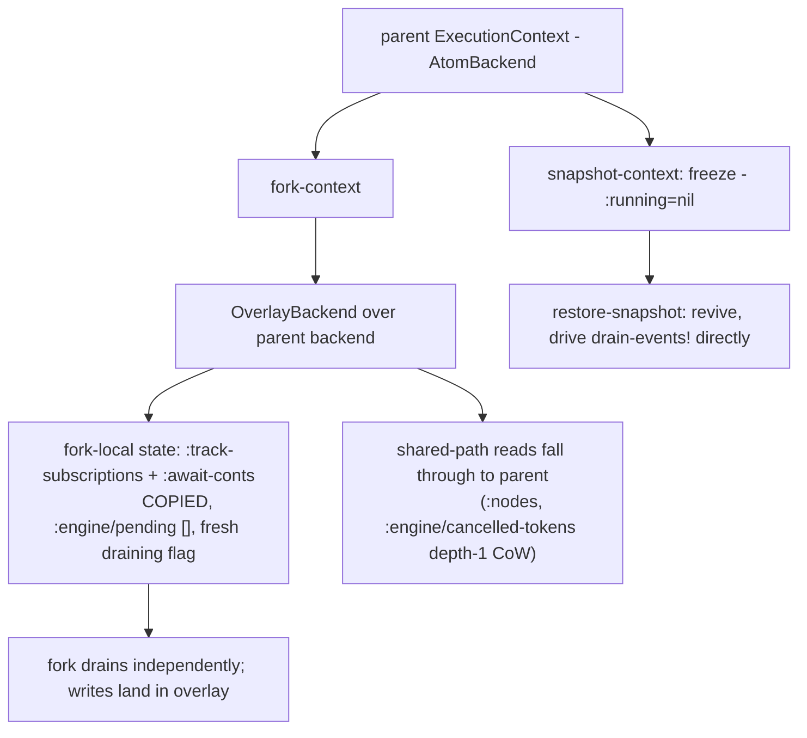

# Spindel Engine Formalism

> **Conceptual ladder — rung 5 of 5.** The rigorous companion to
> `engine-walkthrough.md`: every claim is stated as a law and classified
> Holds / Conjectured / Violated, with `file:line` citations. Read
> `concepts.md` → `engine-walkthrough.md` → `engine.md` → `scheduling.md`
> first; this doc assumes their vocabulary and adds proof obligations,
> algebra, and the remaining normalization backlog. It does not
> re-explain the model — it formalizes it.

A formal account of the spindel reactive engine as it stands on branch
`refactor/engine-regularization` (post-regularization: `SpinNode :kind`
explicit, `register-spin!` dispatches on `:kind`, continuation `:kind`
explicit, per-slice `:slice-state`, the continuation table split into
`:track-subscriptions` + `:await-conts`, and a single unified
`resume-body!` taking a `:mode`).

This document is descriptive and analytical — it does not propose
engine changes inline. Part 5 collects the *remaining* normalization
opportunities (several earlier ones are now done — see Part 5's intro).

Citations are `file:line` against the source tree at this branch.

Companion docs: `docs/engine.md` (architecture narrative),
`docs/scheduling.md` (operational), `docs/concepts.md` (user model),
`docs/incremental.md` (delta algebra user view).

---

## Part 1 — The Model

### 1.1 Objects

#### Signal

A **signal** is a mutable reactive source. Its runtime state is a
`SignalNode` record (`engine/nodes.cljc:141-170`) stored at
`[:nodes signal-id]`:

```
SignalNode {:snapshot      current value (delta-cleared)
            :old-snapshot  previous value
            :deltas        structural changes since old-snapshot
            :deltaable?    can this value carry deltas?
            :observers     #{spin-id…}  spins that track this signal
            :generation    monotonic counter, incremented per swap}
```

The user handle is a `SignalRef` record (`signal.cljc:88-139`) — a thin
`{:id :initial-value}` pair implementing `IDeref`/`IAtom` (CLJ) and
`IDeref`/`ISwap`/`IReset` (CLJS). `@sig` is a non-reactive read
(`signal.cljc:97-98`); `swap!`/`reset!` route to
`swap-signal*-explicit` (`signal.cljc:264-295`).

The signal carries a **dual-perspective interval**: `(old, new, deltas)`.
A `swap!` computes `new-value = (f old-value …)`, extracts `deltas` via
`d/get-deltas`, stores `clean-value = (d/clear-deltas new-value)` as
`:snapshot`, moves the prior snapshot to `:old-snapshot`, and increments
`:generation` (`signal.cljc:271-285`). The generation counter is the
basis for per-observer delta de-duplication (Part 2.7).

`:deltas` obeys a **three-state contract** (`incremental/interval.cljc:30-49`):

* `nil` — "I don't know what changed; treat `new` as opaque." Consumers
  fall back to full recompute.
* `[]` (empty, non-nil) — "I verified — nothing changed."
* `[delta…]` — "These specific things changed."

#### Spin

A **spin** is a reactive computation, CPS-transformed so it can suspend
and resume. The user handle is the `Spin` deftype (`spin/core.cljc:217-406`),
a stateless `{spin-id, spin-fn}` pair: it holds *no* mutable state — all
state lives on the `SpinNode` in context state. `Spin` implements `IFn`
with the CPS signature `(spin resolve reject)` and `IDeref` (`@spin`
blocks until complete, CLJ only).

Spins have **two kinds**, made explicit by the `:kind` field on the
`SpinNode` (`engine/nodes.cljc:184`), and set authoritatively by
`make-spin` via `spin-register!` (`spin/core.cljc:444-446`):

* **`:computation`** — built by the `spin` / `effect` macro
  (`spin/cps.cljc:157-199`, `:201-249`). It has:
  * a **deterministic, content-addressed id** minted by `next-address!`
    from the macro's source-location and the per-spin hash-chain
    (`spin/cps.cljc:198`);
  * a `:captured-locals` map `{'sym value}` of the body's free
    variables, computed by a real free-variable analysis
    (`spin/cps.cljc:142-154`, `engine/free-vars.clj`);
  * it is **cacheable** (its `SpinNode :result` is a single-slot cache),
    **B-gated** (re-registration re-runs only on captured-environment
    change — Part 2.6), and **replayable** under fork/rebuild.
  * `make-spin`'s 3-arity sets `kind` to `:computation`
    (`spin/core.cljc:431-432`).

* **`:resource`** — built by a direct `make-spin` 1-/2-arity call
  (`spin/core.cljc:427-430`). It has:
  * a **gensym id** (`(keyword (gensym "spin-"))`, `spin/core.cljc:428`)
    — *not* content-addressed, *not* stable across runs;
  * an **effectful one-shot body**: `sleep`, `parallel`, `race`,
    `deferred`, `mailbox` (`spin/combinators.cljc:66-272`,
    `spin/sync.cljc`);
  * it is **not replayable**: `register-spin!` always re-runs a
    re-registered `:resource` spin regardless of captures
    (`engine/impl/simple.cljc:1493-1496`).

Note the irregularity already visible: rate-control combinators
(`debounce`, `throttle`, `sample`, `timeout`, `relieve`, `accumulate`)
are built with the `spin` macro (`spin/combinators.cljc:300-466`), so
they are `:computation` spins — but they *compose* `:resource` spins
(`sleep`, `race`). See Part 5.

#### Continuation

A **continuation** is a suspension point in a spin body — the reified
"rest of the body" past a `track` or `await` call. It is a plain map.
The continuation table is **split in two** (the regularization landed
this — Part 5's old §5.1):

* **`[:track-subscriptions spin-id]`** — the comonadic track conts of a
  spin. Persistent: a track cont watches a signal and re-runs the body
  on every change, so it is never reaped at a generation boundary.
* **`[:await-conts spin-id]`** — the monadic await conts of a spin.
  Some are ephemeral (reaped at the generation boundary), some
  persistent (a reactive child can re-complete).

`add-continuation!` routes a new cont to one structure or the other via
`track-cont?` (`engine/impl/simple.cljc:344-359`, `:2010-…`), a `case`
on `:kind` with no `:else` (an unknown kind throws). `:order` is **one
monotone insertion sequence across both structures**, so the relative
order of a track cont and an await cont in the same body is still
well-defined (`add-continuation!` counts both tables —
`engine/impl/simple.cljc:2060-2064`).

Every continuation carries an explicit `:kind` (the regularization
removed the implicit `:ephemeral-await?` flag):

| `:kind`            | created by                                  | persistence                                                    | resume semantics |
|--------------------|---------------------------------------------|----------------------------------------------------------------|------------------|
| `:track`           | `effects/track.cljc:166`                    | persistent — never reaped at generation bounds                 | comonadic — re-runs the body slice on every signal change |
| `:await-reactive`  | `effects/await.cljc:111` (PSpin child); `combinators.cljc:113` | persistent — survives `clear-all-await-continuations!`          | monadic — re-fires when a reactive child re-completes |
| `:await-once`      | `effects/await.cljc:111` (non-reactive child) | ephemeral — reaped at generation boundary                      | monadic — one-shot child completion |
| `:external-await`  | `effects/await.cljc:437` (Deferred/Mailbox/ifn) | ephemeral — reaped at generation boundary                      | monadic — one-shot external resolution, cancellation-gated |

Common cont fields: `:id`, `:order` (insertion ordinal within the
spin), `:event-key` (`[:signal sid]` or `[:spin/complete tid]` or
`[:external-await tag]`), `:resolve-fn`, `:reject-fn`, `:on-resume`,
`:bindings` (captured dynamic vars), and the regularization's
**`:slice-state`** — a single map `{:bindings :chain-head :tracking}`
(`effects/track.cljc:177-179`, `effects/await.cljc:54-63`). Pre-
regularization these three were separate per-slice snapshots; step 5/7
folded them.

Track conts additionally carry `:signal-id` and `:consumed-generation`.
Await conts additionally carry `:awaited-spin` (a strong reference
preventing premature GC, `effects/await.cljc:98-109`) and `:resume-fn`
(monadic result routing, `effects/await.cljc:129-132`). External-await
conts carry `:cancel-token` and `:cancel!`.

#### SpinNode

Persistent engine state per spin (`engine/nodes.cljc:176-210`),
stored at `[:nodes spin-id]`:

```
SpinNode {:result        cached Result record (or nil)
          :status        :clean | :dirty
          :completed?    body has resolved at least once
          :running?      body invoked but not yet resolved (incl. suspended)
          :observers     #{spin-id…}  spins depending on this one
          :deps          {:signals #{…} :spins #{…}}  committed deps
          :created-by    spin-id that created this spin (nil at root)
          :created-spins #{spin-id…}  spins created during last body run
          :kind          :computation | :resource}
```

Ad-hoc `assoc`'d (not defrecord fields): `:captured-locals`,
`:spin-scope`, `:orphaned?`, `:generation` (on SignalNode only). The
status keyword pair `:clean`/`:dirty` is the single-slot cache validity
bit; `:result` is the cache slot.

#### Result

`Result {:variant :ok|:error :payload value-or-throwable}`
(`spin/core.cljc:40-56`). The monadic carrier of a spin's outcome.

#### The dependency DAG

Two edge kinds, both materialized as `:observers` sets on nodes:

* **spin → signal** via `track`. `track-signal-dep!`
  (`engine/impl/simple.cljc:1335-1384`) eagerly adds the spin to the
  signal node's `:observers` *and* to the spin's transient
  `[:spin-tracking spin-id :signals]`.
* **spin → spin** via `await`. `track-spin-dep!`
  (`engine/impl/simple.cljc:1386-1424`) eagerly adds the parent to the
  child node's `:observers` *and* to `[:spin-tracking parent :spins]`.

The forward index is `[:nodes id :observers]`; the reverse index for
event dispatch is `[:subscriptions event-key spin-id] → #{cont-id…}`.
A third structure, `:created-spins`, records parent→child *creation*
(not data dependency) for descendant filtering.

The graph is required to be **acyclic** for the topological sort
(`engine/impl/graph.cljc:30-61`); `find-root-await-ancestor` has an
explicit cycle guard returning the current node on revisit
(`engine/impl/simple.cljc:484-490`), so a malformed cyclic graph
degrades rather than hangs.

#### The event queue

A FIFO vector at `[:engine/pending]`, drained by `drain-events!`
(`engine/impl/simple.cljc:776-900`). Five event types
(`engine/impl/simple.cljc:509`):

| event                | carries                          | handler effect |
|----------------------|----------------------------------|----------------|
| `:signal-change`     | `:id` signal-id                  | resume observers' earliest track conts (topological) |
| `:spin-completion`   | `:id` spin-id                    | resume awaiting parents' await conts; propagate dirty |
| `:deferred-delivery` | `:deferred :value`               | `deliver-inline!` — resume deferred readers |
| `:mailbox-post`      | `:mailbox :msg`                  | `post-inline!` — resume one mailbox waiter |
| `:spin-execution`    | `:id :spin :resolve-fn :reject-fn` | claim + run a cold spin body |

A single CAS lock `[:engine/draining?]` guarantees one drainer; cascade
events enqueued during draining are picked up by the same loop in FIFO
order (`engine/impl/simple.cljc:817-881`).

#### Interval / deltas

An `Interval` (`incremental/interval.cljc:87-147`) is a deftype
`(old-value, new-value, deltas)` with `IDeref` (→ new), `ILookup`
(`:old`/`:new`/`:deltas`), and `IIndexed` (`[new old deltas]`
destructuring). It is the comonadic context that `track` delivers
(Part 2.1). `track` returns `(iv/->Interval old snapshot deltas)`
(`effects/track.cljc:69`).

The **typed delta algebra** (`incremental/algebra.cljc`,
`sequence_algebra.cljc`, `map_algebra.cljc`) describes how deltas
`apply` / `compose` / `state-diff` for a value type. Each algebra is a
monoid `(D, ·, id)` — see Part 2.2.

### 1.2 Operations

| operation             | location                              | effect |
|-----------------------|---------------------------------------|--------|
| `signal`              | `signal.cljc:227-262`                 | mint a SignalRef with deterministic id |
| `swap!` / `reset!`    | `signal.cljc:264-295`                 | mutate snapshot, bump generation, enqueue `:signal-change` |
| `spin` / `effect`     | `spin/cps.cljc:157-249`               | CPS-transform body, mint `:computation` Spin |
| `make-spin`           | `spin/core.cljc:412-493`              | register a `:resource` or `:computation` SpinNode |
| `track`               | `effects/track.cljc:105-197`          | synchronous read + persistent re-run subscription |
| `await`               | `effects/await.cljc:134-320`          | one-shot suspension on a child spin / resource |
| `(spin r e)` invoke   | `spin/core.cljc:222-390`              | run / cache-hit / rebuild a spin body |
| `drain-events!`       | `engine/impl/simple.cljc:831-…`       | process the event queue to fixpoint |
| `process-event!`      | `engine/impl/simple.cljc:545-…`       | dispatch one event |
| `resume-body!`        | `engine/impl/simple.cljc:411-…`       | unified body-slice resume, `mode ∈ {:track :await}` |
| `add-continuation!`   | `engine/impl/simple.cljc:2010-…`      | route a new cont to `:track-subscriptions` / `:await-conts` by `:kind` |
| `cache-result!`       | `engine/impl/simple.cljc:1781-…`      | store Result, mark observers dirty |
| `register-spin!`      | `engine/impl/simple.cljc:1517-…`      | create/update SpinNode, B-gate re-run |
| `reconcile-deps!`     | `engine/impl/simple.cljc:1078-…`      | shared observer-edge reconciliation core |
| `record-deps!`        | `engine/impl/simple.cljc:1137-…`      | commit transient deps; prune dropped observers |
| `fork-context`        | `engine/context.cljc:422-551`         | O(1) overlay copy |
| `snapshot`/`restore`  | `engine/context.cljc:705-812`         | freeze / revive a context |

### 1.3 Glossary

* **Spin** — a CPS-transformed reactive computation.
* **Computation spin** — `:kind :computation`; deterministic id,
  B-gated, cacheable, replayable.
* **Resource spin** — `:kind :resource`; gensym id, effectful one-shot,
  not replayable.
* **Signal** — mutable reactive source carrying `(old, new, deltas, generation)`.
* **Interval** — the `(old, new, deltas)` triple; comonadic context of `track`.
* **track** — synchronous signal read installing a persistent re-run
  subscription. *Comonadic.*
* **await** — one-shot suspension on a child spin or resource. *Monadic.*
* **Continuation** — reified rest-of-body at a suspension point; one of
  four `:kind`s.
* **Slice / body slice** — the run of straight-line body code between
  two consecutive suspension points.
* **`:slice-state`** — `{:bindings :chain-head :tracking}`, the
  per-slice snapshot restored at resume.
* **SpinNode / SignalNode** — persistent per-node engine state.
* **Generation** — monotone per-signal counter; basis for delta dedup.
* **Drain** — one pass of `drain-events!` to queue-empty.
* **Batch** — `:engine/current-batch` metadata live during one
  `:signal-change`; carries a generation and dedup atoms.
* **B-gate** — `register-spin!`'s `identical?`-comparison of
  `:captured-locals` deciding whether a re-registered computation spin
  re-runs.
* **Delta algebra** — a monoid `(D, ·, id)` of structural deltas for a
  value type.
* **Order** — the insertion ordinal of a continuation within its spin;
  used by `truncate-stale-conts!` and `earliest-continuation`.

---

## Part 2 — Algebraic Properties

Each law below is stated, then classified **Holds** (with the enforcing
code), **Conjectured** (plausible but not enforced/tested), or
**Violated / fragile** (with the failure mode).

### 2.1 `track` as a comonad

**Claim.** `track` exposes a comonadic structure: the value it delivers
is an `Interval` `(old, new, deltas)` — a *context-carrying* value, not
a bare value. The comonad is "a value in the context of its own
history."

Mapping to comonad operations:

* `extract : W a → a` is `@interval` / `(:new interval)` — discard the
  context, take the current value (`interval.cljc:97-98`).
* `duplicate : W a → W (W a)` corresponds to re-tracking: the body
  re-runs and `track` again delivers an interval, whose `old` is the
  previous `new`. The persistence of the track continuation
  (`:kind :track`, never reaped — `clear-all-await-continuations!` only
  reaps `:await-once`/`:external-await`, `engine/impl/simple.cljc:1597-1600`)
  is what makes the comonadic *co-bind* well-defined: the body is a
  co-Kleisli arrow `W a → b` that the engine re-invokes on each new
  context.

**Counit / identity law** — `extract ∘ duplicate = id`. The first
`track` call returns `(iv/->Interval old snapshot deltas)` synchronously
(`effects/track.cljc:197`); `@` of it yields `snapshot`, the live value.
**Holds** structurally.

**Comonad coherence across re-runs.** On a signal change the engine
resumes the *earliest* track cont and truncates later ones
(`truncate-stale-conts!`, `engine/impl/simple.cljc:329-361`); the body
slice re-runs from that track point with `:slice-state` restored. The
"context" delivered on resume comes from `:on-resume` →
`get-track-value-if-newer` (`effects/track.cljc:71-103`), which honours
generation so a stale resume delivers `deltas = nil` rather than
replaying consumed deltas. **Holds**, modulo the generation caveat
in 2.7.

**Status: Holds (structural).** The comonad laws are not mechanized;
the structure is real and the engine's persistence + interval delivery
realize it. Conjectured: a full categorical proof would need
`track` to be referentially transparent in its argument, which it is
(it dispatches solely on `SignalRef` identity, `effects/track.cljc:209-212`).

### 2.2 `await` as a monad

**Claim.** `await` is monadic sequencing over `Result`. The CPS
transform makes a spin body a sequence of `await`-bind steps; each
`await` is `>>= : M a → (a → M b) → M b` where the continuation is the
`a → M b` arrow.

* **Return** — a spin that resolves synchronously is `return v`: the
  body invokes `resolve` directly (`spin/core.cljc:311-342`).
* **Bind** — `await child` suspends the parent; when `child` completes,
  `:resume-fn` pattern-matches the child's `Result` and routes `:ok`
  payload to the cont's `:resolve-fn`, `:error` payload to `:reject-fn`
  (`effects/await.cljc:129-132`). This is the Either/Result monad's
  bind: errors short-circuit.

**Left identity** — `return a >>= f = f a`. An `await` of an
already-completed child takes the fast path and resumes inline with the
cached value (`effects/await.cljc:165-190`). **Holds.**

**Right identity** — `m >>= return = m`. A spin body whose last form is
`(await child)` resolves with the child's value unchanged (the outer
`resolve` is called with the child payload). **Holds.**

**Associativity** — `(m >>= f) >>= g = m >>= (λx. f x >>= g)`. CPS
nesting is associative by construction: `ioc/invert`
(`spin/cps.cljc:136`) produces a right-nested continuation chain
regardless of how `await`s are grouped in source. **Holds (structural).**

**Error short-circuit** — the Result monad's defining property. A child
`:error` routes to `:reject-fn` → `abort-spin-chain!`
(`spin/core.cljc:345-381`, `:524-546`), which caches the error and
marks observers dirty so they rediscover it. **Holds.**

**Status: Holds (structural).** Not mechanized; CPS construction
guarantees the monad laws the way any CPS encoding of a monad does.

### 2.3 The typed delta algebra laws

Each algebra is a monoid `(D, ·, id)` with `-apply-deltas`,
`-compose-deltas`, `-empty-deltas` (`incremental/algebra.cljc:42-63`),
subject to three laws (stated `algebra.cljc:13-17`).

**Identity** — `apply(t, id) = t`.
* `ScalarAlgebra` — `id = ::no-change`; `-apply-deltas` returns `old`
  unchanged for it (`algebra.cljc:186-188`). **Holds.**
* `SequenceAlgebra` — `id = (empty-diff size)` (all-zero/empty fields,
  `sequence_algebra.cljc:70-74`); `apply-pipeline` of an empty diff is a
  grow-0/shrink-0/identity-perm/empty-change no-op
  (`sequence_algebra.cljc:91-114`). **Holds.**
* `MapAlgebra` — `id = {:assoc {} :dissoc #{} :update {}}`;
  `apply-pipeline` over empty fields is identity. **Holds.**

**Application homomorphism** — `apply(t, d₁·d₂) = apply(apply(t,d₁), d₂)`.
* Scalar — last-write-wins compose; `apply(apply(t,d1),d2)` and
  `apply(t,d2)` agree because compose returns `d2` unless `d2` is
  no-change (`algebra.cljc:193-198`). **Holds.**
* Sequence — `compose-pair` (`sequence_algebra.cljc:136-172`) is
  carefully built so the composed diff reproduces the two-step effect;
  the namespace docstring states this and a property test is referenced
  (`algebra.cljc` and `sequence_algebra.cljc:38-48`). **Holds**
  (conjectured complete; relies on the property test).
* Map — `compose` recurses one level into inner algebras
  (`map_algebra.cljc:37-44`). **Holds** for one nesting level;
  **fragile** for sequence-nested paths — `algebra.cljc:259-264` states
  sequence-nested `lift`/`lower` is deferred, the `:change` field has no
  `(:nested algebra delta)` variant yet.

**Associativity of `compose`** — `(d₁·d₂)·d₃ = d₁·(d₂·d₃)`.
* Scalar — trivially associative (last-write-wins). **Holds.**
* Sequence — permutations form a group, the other fields are additive
  monoids; `sequence_algebra.cljc:36-48` claims the quotient monoid is
  associative. **Holds (conjectured, property-tested).**
* Map — per-key folding; associative because each field's merge is
  associative. **Holds (conjectured).**
* `compose-deltas` variadic left-folds (`algebra.cljc:118-125`); the
  fold is well-defined *iff* the binary op is associative.

**`nil` vs `[]` contract.** `nil` = uncertainty, `[]` = verified
no-change (`interval.cljc:30-49`). `no-change?` checks *both*
`old = new` *and* the delta being the algebra's identity
(`interval.cljc:186-219`). **Holds** where producers obey it —
**fragile** because it is a *convention*, not a type: nothing prevents a
combinator from emitting `nil` when it could emit `[]`. The docstring
explicitly warns "Combinators MUST NOT conflate them via `(seq deltas)`
alone."

**Size-composability invariant (Sequence).** `-compose-deltas` throws
if `size-after(d1) ≠ size-before(d2)` (`sequence_algebra.cljc:395-401`).
This makes the sequence algebra a *partial* monoid — composition is
defined only for size-compatible pairs. **Holds** (enforced by throw);
worth noting it is not a total monoid.

### 2.4 Glitch-freedom

**Law.** Within one drain, a spin re-runs *at most once per generation*,
and observers run after their dependencies (topological order).

* **Topological dispatch.** `:signal-change` resolves observers via
  `rtp/ordered-observers` → `topological-sort` (Kahn's algorithm,
  `engine/impl/graph.cljc:30-81`) over the transitive observer closure.
  **Holds** for the synchronous portion of the graph.
* **Descendant filtering.** `compute-descendant-observers`
  (`engine/impl/simple.cljc:448-461`) removes observers that will be
  re-created by a parent observer, preventing them from firing
  independently. **Holds.**
* **Escalation.** `find-root-await-ancestor` escalates a child observer
  to its root await-ancestor so child-fires-then-parent-refires
  double-execution is avoided (`engine/impl/simple.cljc:463-490`,
  `:561-588`). **Holds.**
* **Per-generation dedup.** `:spin-completion` keys `[parent child
  generation]` in `(:resumed-conts batch)` and skips an already-resumed
  triple (`engine/impl/simple.cljc:653-679`). Track deltas are deduped
  per-observer by `:consumed-generation` (2.7).
* **Async caveat — fragile.** The docstring at
  `engine/impl/simple.cljc:511-526` is explicit: glitch-freedom holds
  only within the **synchronous** portion. A body suspended on a
  `:deferred-delivery` / `:mailbox-post` resolves in a *later* drain
  pass — async branches are only **eventually consistent**. A diamond
  where one arm is async and one is sync *can* transiently show a glitch
  (the sync arm updates, the async arm lags). This is a deliberate
  design boundary, not a bug, but it means the glitch-freedom law is
  **scoped**, not absolute.

**Status: Holds for the synchronous sub-graph; explicitly scoped (not a
global law) across async boundaries.**

### 2.5 Determinism / replay

**Law.** Re-executing the same code path produces the same spin ids,
hence cache hits land on the same nodes — enabling fork/restore.

* **Computation spins** — ids minted by `next-address!` from
  `(source-loc, chain-head)` (`addressing.cljc:133-155`). The chain-head
  is **per-spin**, seeded at body start with
  `body-start-chain-head` (`addressing.cljc:74-87`) and restored at
  resume from `:slice-state :chain-head`. The same call sequence in the
  same body produces the same id sequence. **Holds.**
* **The computation-vs-resource split is the replay-membership rule.**
  Only `:computation` spins are in the replay set: their ids are
  deterministic and `register-spin!` can serve cached results under
  rebuild. `:resource` spins get gensym ids (`spin/core.cljc:428`) and
  are *not* replayable — `register-spin!` always re-runs them
  (`engine/impl/simple.cljc:1493`). This is correct: a `sleep`/`mailbox`
  body is effectful and one-shot; replaying it would re-arm the timer.
  **Holds**, and is the clean formal payoff of step 1/7 of the
  regularization.
* **Rebuild mode** — `Spin` invoke Case 1a (`spin/core.cljc:231-253`)
  executes the body for side effects (re-creating nested spins,
  re-registering conts) while returning the cached value. Relies on the
  per-spin chain-head being re-seeded (`spin/core.cljc:240`). **Holds.**
* **Fragility** — determinism depends on the body being a pure function
  of its captures and source location. A body that mints spins inside a
  data-dependent loop without `with-key` (`addressing.cljc:194-216`)
  will produce *colliding* ids across iterations. The engine does not
  detect this; it is a usage contract.

**Status: Holds; the kind split makes the replay set precisely the
content-addressed spins.**

### 2.6 The B-gate (idempotence of re-registration)

**Law.** Re-registering a `:computation` spin re-runs its body **iff**
its captured environment changed; otherwise re-registration is a no-op
on cache validity (idempotent).

`register-spin!` (`engine/impl/simple.cljc:1476-1501`): on
re-registration of an *existing* node, it re-runs (marks
`{:completed? false}` + dirty) when

```
(or (= kind :resource)
    (captures-changed? old-captures new-captures))
```

`captures-changed?` (`engine/impl/simple.cljc:1441-1452`) returns true
if the key set differs *or* any value is not `identical?` to its prior.

* **Idempotence** — re-registering with `identical?` captures leaves the
  node `:clean` and `:completed?` true: `await`/`@spin` serve the cache.
  **Holds.**
* **`identical?` not `=`** — O(1), never throws; Clojure structural
  sharing keeps unchanged persistent values `identical?`. The cost is an
  occasional needless re-run when a value is rebuilt `=`-equal but not
  `identical?` (`captures-changed?` docstring). This makes the gate a
  **sound over-approximation**: it may re-run when it didn't need to,
  but it never *skips* a re-run that was needed. **Holds (conservative).**
* **`:resource` always re-runs** — correct, since resource bodies are
  effectful (2.5).
* **First registration** — new node, records captures, no re-run gate
  applies. **Holds.**

This is the formal content of the `stale_lexical_scope_test` regression
(`test/.../stale_lexical_scope_test.cljc`): a nested `(spin …)` form
re-evaluated by a re-running parent yields a *fresh closure*; the B-gate
re-runs it iff its captured environment actually changed.

**Status: Holds; sound conservative idempotence.**

### 2.7 Per-observer delta-once delivery

**Law.** Each observer of a signal sees each generation's deltas
*exactly once*.

A track cont captures the signal's `:generation` at registration as
`:consumed-generation` (`effects/track.cljc:128-129`, `:182-186`). On
resume, `get-track-value-if-newer` returns deltas only if
`current-generation > consumed-generation`, else delivers
`(Interval new new nil)` (`effects/track.cljc:71-103`).

**Fragility — open question.** The `:consumed-generation` is captured
once at cont *creation* and is **not advanced** when the cont fires.
`get-track-value-if-newer` compares against the *original* captured
generation. On resume the body slice re-runs and `track` is called
again, creating a *new* cont with the *then-current* generation — so in
the normal track-resume path the consumed generation does advance via
cont replacement. But the persistent track cont is *also* the one
`truncate-stale-conts!` keeps for `:order`-less conts and re-tracks via
`track-signal-dep!` — and that re-track does *not* refresh
`:consumed-generation`. **Conjectured latent issue:** a spin tracking
signal A and B, resumed on B, keeps A's cont with A's *old*
consumed-generation; if A then changes, the resume delivers A's deltas
correctly, but if the body slice that re-tracks A is the *truncate*
re-track (not a body re-run), the generation is stale. The
`multi_track_observer_test` pins the *observer-set* survival but does
**not** assert delta-once for the kept cont. Flag for the design
discussion.

**Status: Holds for the common path; conjectured edge case around
truncate-re-tracked conts — recommend a targeted test.**

### 2.8 Commutativity of independent signal changes

**Law.** Two signal changes to *independent* sub-graphs produce the same
final state regardless of order.

Each `:signal-change` is processed as its own event with its own batch
(`engine/impl/simple.cljc:532-535`); FIFO ordering of the queue means
two enqueued signal changes drain sequentially. For *disjoint* observer
sets the two drains touch disjoint nodes, so the result is
order-independent. **Holds (conjectured)** — not mechanized, but follows
from disjointness + the per-event batch isolation.

For *overlapping* sub-graphs order matters and the engine makes no
commutativity claim — last-write-wins on the shared spin's cache. The
`batch` macro (`signal.cljc:21-55`) coalesces multiple swaps into one
`:signal-change` *per distinct signal* in insertion order, which is a
determinism aid, not a commutativity guarantee.

### 2.9 Resume idempotence

**Law.** `resume-body!` applied to the same `(spin, cont)` is safe to
attempt more than once without double-executing side effects.

`resume-body!` (`engine/impl/simple.cljc:411-…`) itself is not
idempotent — it unconditionally re-runs the body slice. Idempotence is
provided by the layers around it:

* **`:spin-completion` dedup** — `[parent child generation]` triple
  guard prevents a second resume of the same await cont in one batch
  (`engine/impl/simple.cljc:653-679`).
* **Cancellation gate** — for external-await, `truncate-stale-conts!`
  fires `:cancel!` before dissociating a stale cont
  (`engine/impl/simple.cljc:355-356`); the orphaned external closure
  then no-ops via `cancellable-external-pair`'s gate
  (`effects/await.cljc:322-463`). This is precisely the
  `cont_cancellation_test` regression: a deferred's `:pending` holds
  *both* the orphaned and the new resolve closure; only the new one
  advances. **Holds.**
* **`try-claim-execution!`** — atomic cache+running check prevents two
  `:spin-execution` events from both running a cold body
  (`engine/impl/simple.cljc:1852-1899`). **Holds.**

**Status: Holds — idempotence is enforced by dedup + cancellation gate +
claim, not by `resume-body!` itself.** This is a structural observation
worth flagging: `resume-body!` is the *one* resume path now (the
regularization collapsed the four near-duplicate re-execution paths),
and it takes a single `mode ∈ {:track :await}` argument. The mode is a
`case` with no `:else`, so an illegal mode throws rather than silently
mis-resuming; the per-mode data (`:signal-id` to re-track for `:track`,
`:resume-fn` for `:await`) is carried by the continuation itself. See
Part 4 and Part 5.

---

## Part 3 — Flow-Chart Formalism

### 3.1 The drain cycle



### 3.2 Signal-change propagation



### 3.3 The await-cascade



### 3.4 Track-resume (comonad) vs await-resume (monad)



The two columns are exactly the comonad/monad distinction, and the
`mode` argument names which one. A `:track` resume *re-runs* (comonadic
co-bind: re-invoke the co-Kleisli arrow on a new context); an `:await`
resume *advances* (monadic bind: feed the bound value into the rest).
`resume-body!` derives all the per-mode behavior from `mode` — the four
behaviors are not a 4-tuple of caller-supplied flags.

### 3.5 Computation-spin lifecycle



### 3.6 Resource-spin lifecycle



### 3.7 Fork / restore



---

## Part 4 — Correctness per Reactive Composition

For each composition: the **invariant** that must hold, and the
**argument** the engine preserves it (or where it is fragile).

### 4.1 Nested spins (spin-in-spin)

**Invariant.** A `(spin …)` form lexically inside another spin's body,
re-evaluated when the parent re-runs, must observe its *current* captured
lexical scope — no stale closure.

**Argument.** The parent re-run re-evaluates the inner `(spin …)` form,
producing a fresh `cps-fn` closure over the new locals and a fresh
`:captured-locals` map. `register-spin!`'s B-gate
(`engine/impl/simple.cljc:1489-1497`) compares `:captured-locals` with
`identical?` and re-runs the inner spin iff a capture changed. The
inner spin's id is *stable* across parent re-runs (per-spin chain-head
re-seeded at parent body start, `addressing.cljc:121-127`), so the
re-evaluation lands on the *same* SpinNode — re-registration, not a new
node. **Holds** — this is the `stale_lexical_scope_test` /
`nested_spin_invalidation_test` regression, fixed by B.

### 4.2 `track` inside a re-running spin

**Invariant.** Each `track` call re-registers a persistent cont; the
spin remains an observer of every signal it tracks, across re-runs.

**Argument.** `track-signal-dep!` eagerly registers the observer at
*track time* (`engine/impl/simple.cljc:1335-1384`). On a body re-run the
new track call re-registers; `record-deps!` at body completion prunes
only signals tracked *last* run but *not this* run
(`engine/impl/simple.cljc:1063-1084`). **Fragile point — see 2.7 and
4.4:** the `:slice-state :tracking` snapshot must include the
just-tracked signal, else `record-deps!` would commit deps missing it
(`effects/track.cljc:146-159` documents this fix; `multi_track_observer_test`
is the regression). **Holds post-fix.**

### 4.3 `await` inside a spin (await-cascade)

**Invariant.** When an awaited child completes, the parent resumes
exactly once per completion, with the child's Result correctly routed
(`:ok`→value, `:error`→propagated).

**Argument.** `:spin-completion` dispatch resumes the parent's await
cont via `resume-body!` in `:await` mode, the cont's `:resume-fn` doing
the monadic match (`effects/await.cljc:129-132`). The
`[parent child generation]` dedup prevents a double resume in one batch.
`:await` mode does no truncation, no dirty/running re-mark, and no
`:created-spins` clear, because it *advances* a still-suspended body
rather than re-running it — wiping `:created-spins` would drop the
awaited child itself. **Holds.**

### 4.4 `track` + `await` in one body (continuation `:order` truncation)

**Invariant.** A body `(track A) … (await X) …`: if A changes while
suspended on X, the body re-runs from the `track A` point and the stale
`await X` cont must be cancelled so X's eventual completion does *not*
also advance the orphaned slice.

**Argument.** `truncate-stale-conts!` drops every cont with
`:order` > the resumed track cont, firing `:cancel!` first
(`engine/impl/simple.cljc:329-361`). For external resources the
cancellation gate (`cancellable-external-pair`) makes the orphaned
closure a no-op (`effects/await.cljc:322-463`). For a child Spin await,
the truncated cont simply ceases to exist, so the child's
`:spin-completion` finds no subscriber for the old cont. The
re-running body re-issues a fresh `await X` cont. **Holds** — this is
the `cont_cancellation_test` suite (deferred, mailbox, fork-isolation).

**Open subtlety.** Conts with `:order` *less* than the resumed one are
*kept* and their signal deps re-tracked (`engine/impl/simple.cljc:357-361`)
— but `truncate-stale-conts!` re-tracks via `track-signal-dep!`, which
does **not** refresh `:consumed-generation`. See 2.7 — flagged.

### 4.5 Sibling spins

**Invariant.** Two spins observing the same signal both re-run on a
change, in topological order, each at most once.

**Argument.** `ordered-observers` returns both in a Kahn topological
order (`engine/impl/graph.cljc:63-81`); the JVM path may resume
*independent* observers in parallel on the executor with a
`CountDownLatch` join (`engine/impl/simple.cljc:603-623`) — safe because
each resume is atomic `swap-state!` on its *own* node. CLJS is always
sequential. **Holds.**

### 4.6 `parallel` / `race`

**Invariant (parallel).** Completes when all children complete; result
is the vector of child results; reactive — re-fires when a child
re-completes.

**Argument.** `parallel` is a `:resource` spin
(`spin/combinators.cljc:66-163`). It registers an `:await-reactive`
cont per child (`combinators.cljc:111-141`) so a child's later
re-completion re-caches `parallel`'s result and enqueues a fresh
`:spin-completion`. Fail-fast: first child error cancels siblings
(`combinators.cljc:145-151`). **Holds.** *Fragile:* coordination atoms
`completed`/`done?` are local closures, *not* in context state — the
docstring admits they are "write-once, not forked"
(`combinators.cljc:63-64`). A fork of a context with an in-flight
`parallel` shares those atoms — correct only because they are write-once.

**Invariant (race).** Completes with the first child; losers cancelled.
**Argument.** `compare-and-set!` on `done?` picks the winner
(`combinators.cljc:246-265`); cancellation errors from losers are
swallowed. **Holds.**

### 4.7 `debounce` / `throttle` / `sample`

**Invariant.** Rate-control combinators delay / coalesce value delivery
without losing the *final* value.

**Argument.** Each is a `:computation` spin composing a `:resource`
`sleep` then an `await` of the source (`combinators.cljc:300-353`).
When the source signal changes, the *computation* spin re-runs from the
top (it tracks the source transitively), restarting the `sleep` — that
is the debounce timer reset. **Holds for value delivery.** *Fragile:*
the namespace docstrings note rate control "may lose intermediate
deltas" unless wrapped in `accumulate` (`combinators.cljc:455-456`) —
i.e. the *delta* history is not preserved by debounce/throttle alone,
only the snapshot. `accumulate` (`combinators.cljc:457-466`) uses a
closure atom that persists across re-runs to merge intervals; its
correctness depends on `merge-fn` being associative (a stated
precondition, `combinators.cljc:425-427`).

### 4.8 Deep nesting under await-cascade

**Invariant.** A → awaits → B → awaits → C: when C completes, the
completion propagates up through B to A, each parent resuming once.

**Argument.** Each completion enqueues its own `:spin-completion`;
`process-event!` resumes the immediate parents, whose own resolution
enqueues the next `:spin-completion` — a cascade through the FIFO queue.
`propagate-await-dirty!` (`engine/impl/simple.cljc:1658-1711`) marks
*completed, non-suspended* ancestors dirty so a re-run reaches stale
caches. **Holds.** *Fragile:* `find-root-await-ancestor`
(`engine/impl/simple.cljc:463-490`) walks `:observers` taking
`(first parents)` — for a spin awaited by *multiple* parents it picks
an arbitrary one as "the" root. Escalation to *one* root is fine when
the await graph is a tree; for a DAG with shared awaited children the
"root" is non-deterministic. Flagged as a latent question.

### Invariant summary table

| composition          | glitch-free | no double-exec | no stale-cache | no orphan cont | deterministic id |
|----------------------|:-----------:|:--------------:|:--------------:|:--------------:|:----------------:|
| nested spins         | ✓           | ✓ (B-gate)     | ✓ (B-gate)     | ✓              | ✓                |
| track in re-run      | ✓           | ✓              | ✓              | ✓ (post-fix)   | ✓                |
| await-cascade        | ✓ (sync)    | ✓ (dedup)      | ✓ (propagate)  | ✓              | ✓                |
| track + await        | ✓           | ✓ (cancel gate)| ⚠ gen-staleness | ✓ (truncate)  | ✓                |
| sibling spins        | ✓           | ✓              | ✓              | ✓              | ✓                |
| parallel / race      | ✓           | ✓ (CAS)        | ✓              | ✓              | ✗ (resource)     |
| debounce/throttle    | ✓           | ✓              | ⚠ deltas lost  | ✓              | ✓ (comp) / ✗ (sleep) |
| deep await nesting   | ✓ (sync)    | ✓              | ✓              | ✓              | ⚠ multi-parent root |

---

## Part 5 — Deduplication & Normalization Opportunities

Post-regularization the engine is markedly cleaner: one `:kind` field
discriminates the two spin worlds, one continuation `:kind` enumerates
the four suspension flavors, one `:slice-state` map, one `resume-body!`.

**Several earlier items in this part are now done** and are kept below
as *records of completed work*, not as open proposals:

* **§5.1 — split the continuation table** — **done.** The flat
  `[:continuations …]` map is gone; conts live in
  `:track-subscriptions` and `:await-conts`.
* **§5.5 — `resume-body!` 4-flag option map → `:mode`** — **done.**
  `resume-body!` takes a single `mode ∈ {:track :await}`.
* **§5.6 — one `reconcile-deps!` primitive** — **done.** `record-deps!`
  and the cleanup paths now reconcile observer edges through a single
  `reconcile-deps!`. (The §5.6 sub-proposal to make `:subscriptions` a
  *derived* view rather than a maintained structure is **still open**.)
* **§5.4 — kind-driven disposal** — **partly done.** Resource-timer
  disposal landed (timer handles are retained and cancelled on
  disposal / `stop-context!` / cancellation). Driving caching and fork
  cont-copying from `:kind` is still open.

The genuinely-open items are **§5.2** (event-type collapse), **§5.3**
(`:created-spins` audit), the **derived-`:subscriptions`** half of §5.6,
and **§5.7 / §5.8**.

### 5.1 The continuation table — split (done)

**Status: done.** This was the highest-value normalization and it has
landed. For completeness, the shape it replaced and the shape now:

**Before.** All four cont kinds lived in one flat map
`[:continuations spin-id cont-id]`, ordered by `:order`. `:track` conts
are comonadic (persistent, re-run-the-body); the three `await*` kinds
are monadic (advance-the-slice). `truncate-stale-conts!`,
`earliest-continuation`, `clear-all-await-continuations!`, and
`process-event! :signal-change` each re-derived this split at runtime by
filtering on `:kind` or `:signal-id`.

**Now.** Two structures (`engine/impl/simple.cljc:332-368`):

* `:track-subscriptions[spin-id]` — the comonadic, persistent track
  conts of a spin.
* `:await-conts[spin-id]` — the monadic await conts of a spin.

`add-continuation!` routes by `track-cont?` — a `case` on `:kind` with
no `:else`. `:order` remains **one monotone sequence across both
tables**, so a track cont and an await cont in the same body still have
a well-defined relative order. `clear-all-await-continuations!` now
reads `:await-conts` directly (`engine/impl/simple.cljc:1632-1702`);
`has-live-signal-cont?` is `(seq (get-state ctx [:track-subscriptions
spin-id]))` (`:1320-1334`). The comonad/monad distinction is now a
*structural fact* of where a cont is stored, not a runtime `:kind`
predicate.

### 5.2 Event-type overlap: `:deferred-delivery` / `:mailbox-post` vs `:spin-completion`

**Observation.** Five event types, but `:deferred-delivery` and
`:mailbox-post` both reduce to "an external resource resolved; run its
inline delivery then let the resumed body enqueue a `:spin-completion`."
Their handlers (`engine/impl/simple.cljc:685-717`) are near-identical:
extract `state-atom`, `binding` ctx + `*in-trampoline*`, call
`deliver-inline!` / `post-inline!`.

**Proposal.** Collapse to one `:resource-delivery` event carrying the
resource and a `deliver-fn` (the resource supplies its own inline
delivery). Three event types remain: `:signal-change`,
`:spin-completion`, `:resource-delivery`, `:spin-execution`.

**Payoff.** One handler arm instead of two; new resource types
(channels, websockets) need no new event type. Minor — the two handlers
are short — but it removes a per-resource-type coupling from the engine
core.

### 5.3 `:created-spins` vs the deps DAG

**Observation.** Three relations are tracked between spins:
`:created-by`/`:created-spins` (creation), `:deps :spins` (await
dependency), `:observers` (reverse of both signal-track and
spin-await). `:created-spins` is used *only* by
`compute-descendant-observers` (`engine/impl/simple.cljc:448-461`) for
descendant filtering during signal-change dispatch.

**Question for the design discussion.** Is `:created-spins` derivable?
A child created during a parent's body run is also, in every observed
case, either awaited by the parent (→ in `:deps :spins`) or a structural
child whose parent re-creates it. If creation always implies a
dep or observer edge, `:created-spins` is redundant with the DAG and
`compute-descendant-observers` could walk `:deps`/`:observers` instead.
If there exist created-but-not-depended spins (fire-and-forget
`spawn!`), then `:created-spins` is the *only* record of them and must
stay. **Recommend:** audit whether a created spin can ever lack a
dep/observer edge; if not, delete `:created-spins` and the
`register-spin!` creator-update (`engine/impl/simple.cljc:1511-1515`).

### 5.4 Is the computation/resource distinction fully exploited? (partly done)

The `:kind` field is used for **re-run gating** (`register-spin!`) and
*implicitly* for the **id scheme** (resource = gensym, computation =
content-addressed — enforced at the `make-spin` arity).

**Done — resource-timer disposal.** A `:resource` spin's real-time
delayed entry retains its executor timer handle in
`[:engine/timer-handles spin-id]`, and the handle is cancelled when the
entry fires, is cancelled, or its context stops
(`engine/impl/delayed.cljc:71-96`, `process-delayed-spins!` cleanup,
`fire-delayed-spin!`). A completed or cancelled `sleep` no longer
leaves a pending timer behind.

**Still open.** `:kind` is *not* yet used to drive:

* **Node disposal** — `full-cleanup-spin!` / `try-gc-cleanup-spin!`
  treat both kinds identically. A `:resource` spin is one-shot and could
  be eagerly disposed the moment it resolves (no replay path needs it),
  whereas a `:computation` spin must survive for cache reuse.
* **Caching** — both kinds have a `:result` slot; a `:resource` spin's
  cache is only ever read once (no B-gate replay). The slot could be
  freed on resolution for resources.
* **Fork** — fork copies the continuation tables wholesale. A
  `:resource` spin's in-flight await cont is fork-copied; arguably
  resource conts should not be inherited by a fork. The kind field
  could gate this.

**Proposal (open part).** Make `:kind` the single authority: have
`register-spin!` *assert* `(= :resource kind)` ⇒ gensym id and *drive*
node disposal / caching / fork policy from it. Today the invariant
"resource ⇒ gensym id" is split across `make-spin`'s arities
(`spin/core.cljc:427-432`) with no central check.

### 5.5 `resume-body!` 4-flag option map → `:mode` (done)

**Status: done.** `resume-body!` previously took a four-flag option map
`{:truncate-stale? :mark-dirty? :clear-created-spins? :resume-fn}` whose
inhabited combinations were only two — the comonad/monad split leaked as
a 4-tuple of booleans. It now takes a single `mode ∈ {:track :await}`
argument and derives the per-mode behavior internally
(`engine/impl/simple.cljc:411-…`). The `case` on `mode` has no `:else`,
so an illegal mode throws; per-mode data is carried by the continuation
(`:track` → `:signal-id`, `:await` → `:resume-fn`). The two modes *are*
the co-bind and bind operations, and the call sites are now
self-documenting (`resume-body! … :track` / `… :await`).

### 5.6 Canonical dependency-graph form (reconcile-deps! done; derived :subscriptions open)

**Done — one `reconcile-deps!`.** Observer-edge reconciliation that was
previously duplicated across `record-deps!` and the cleanup paths now
flows through a single `reconcile-deps!` primitive
(`engine/impl/simple.cljc:1078-…`), parameterized by the new dep set
(empty for clear/cleanup, the tracked set for record).

**Still open — derived `:subscriptions`.** Observer edges are stored on
`:nodes[id]:observers` and the *reverse* (cont) index on
`:subscriptions`. The `:subscriptions` map is *purely* a derived reverse
index of the continuation tables — it could be a computed view rather
than a maintained structure, eliminating an entire class of
"index drift" bugs (the `cache-result!` comment at `:1764-1769`
documents one such latent bug already fixed).

### 5.7 Canonical delta form

The three-state `nil`/`[]`/`[…]` contract (2.3) is a *convention*, not a
type. `no-change?` (`interval.cljc:186-219`) has to special-case typed
intervals vs legacy intervals vs deltaable collections — three branches
for one predicate. **Proposal:** make every interval a typed interval
(carry `:algebra`), so `no-change?` is uniformly
`(empty-deltas? algebra deltas)` and `nil`-deltas becomes a typed
"unknown" element of every algebra rather than a sentinel. This removes
the legacy `Interval` deftype vs typed-map dichotomy
(`interval.cljc:175-184`).

### 5.8 Smaller items

* `record-await-dependency!` (`:1641-1656`) is a documented no-op stub
  kept only to dodge a Clojure compile-order quirk. Flag for eventual
  removal once the partial-cps expansion-cache issue is understood.
* `next-id` / `with-key` structural addressing (`addressing.cljc:161-216`)
  coexists with trace addressing but "the `spin` macro currently uses
  per-spin trace addressing" (`addressing.cljc:54-58`). Two addressing
  schemes, one used for spins. Decide whether structural addressing is
  still wanted; if not, delete it.
* `attempt` / `absolve` (`spin/core.cljc:629-658`) build spins with a
  *four-arg* `spin-fn` `(fn [runtime-atom _ resolve _] …)` — but
  `Spin`'s invoke calls `spin-fn` with **two** args
  (`spin/core.cljc:223`). These combinators appear to predate the
  arity-2 CPS migration and are likely **broken** — flag for a test or
  removal.

---

## Most Important Findings

**Correctness concerns (flagged for the design discussion):**

1. **Generation staleness on truncate-re-tracked conts (2.7, 4.4).**
   `truncate-stale-conts!` re-tracks kept conts via `track-signal-dep!`
   without refreshing `:consumed-generation`. The common track-resume
   path is fine (cont replacement refreshes it), but the truncate path
   may leave a stale generation. `multi_track_observer_test` pins
   observer-set survival but not delta-once delivery for the kept cont.
   *Recommend a targeted test.*

2. **`find-root-await-ancestor` picks an arbitrary parent (4.8).** For a
   child awaited by multiple parents it takes `(first parents)` as "the"
   root — non-deterministic for an await *DAG*. Fine for an await tree.
   *Recommend documenting the tree assumption or handling the DAG case.*

3. **`attempt` / `absolve` use a stale 4-arg `spin-fn` signature (5.8)**
   while `Spin` invoke passes 2 args — almost certainly broken since the
   arity-2 CPS migration. *Recommend a regression test or removal.*

4. **Glitch-freedom is scoped, not global (2.4).** It holds for the
   synchronous sub-graph only; async branches are eventually consistent.
   This is by design but should be stated as a *scoped* law, not an
   absolute one.

**Normalizations completed on this branch (no longer open):**

* **Split the continuation table (5.1)** into `:track-subscriptions`
  (comonadic, persistent) and `:await-conts` (monadic). The comonad/monad
  split is now structural, not a runtime `:kind` predicate.
* **`resume-body!` 4-flag option map → `:mode {:track :await}` (5.5).**
* **One `reconcile-deps!`** for observer-edge reconciliation (5.6).
* **Resource-timer disposal (part of 5.4)** — timer handles retained
  and cancelled on fire / cancel / context stop.

**Remaining normalization opportunities (highest payoff first):**

1. **Make `:subscriptions` a derived view of the continuation tables
   (5.6, open half).** The reverse index is purely derivable; making it
   a computed view eliminates an entire class of index-drift bugs (one
   already documented as fixed).

2. **Drive node disposal / caching / fork policy from `:kind` (5.4,
   open half).** The kind split currently drives re-run gating and
   resource-timer disposal; a `:resource` spin could additionally be
   disposed on resolution and excluded from fork cont-copying.

3. **Audit `:created-spins` for redundancy with the deps DAG (5.3);**
   delete it if creation always implies a dep/observer edge.

4. **Collapse `:deferred-delivery` + `:mailbox-post` into one
   `:resource-delivery` event (5.2).**

5. **Canonical delta form (5.7)** and the **smaller items (5.8)** —
   `record-await-dependency!` stub, dual addressing schemes, the
   suspected-broken `attempt` / `absolve`.

The regularization branch has already done the hard structural work:
explicit `:kind` on nodes and conts, one `:slice-state`, one
`resume-body!` with a `:mode`, the split continuation table, and one
`reconcile-deps!`. The *comonad (track) vs monad (await)* duality is now
real and explicit both in the model and in the data structures — the
remaining items (Part 5's open list) are smaller cleanups rather than
structural debt.
