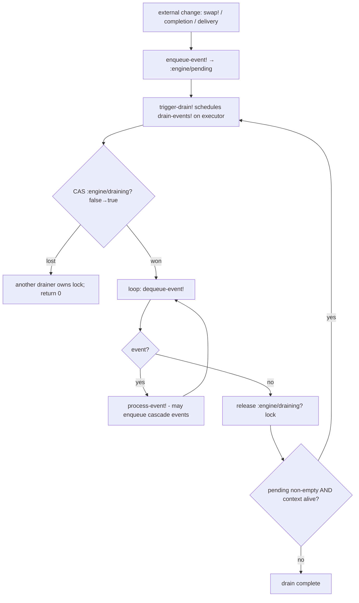
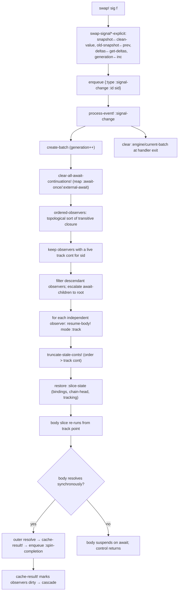
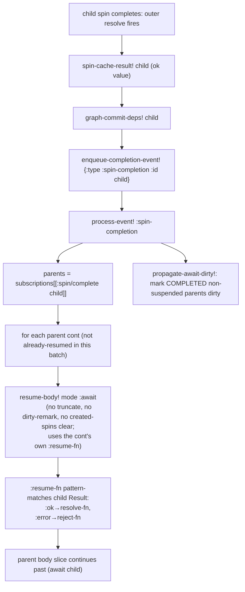
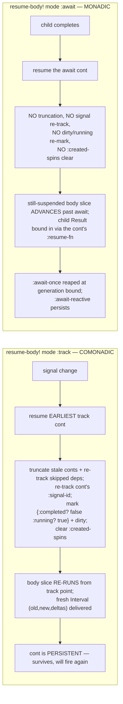
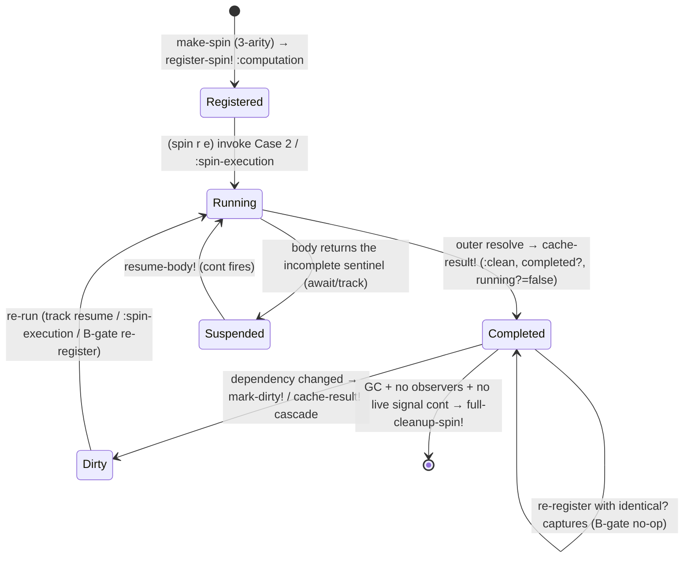
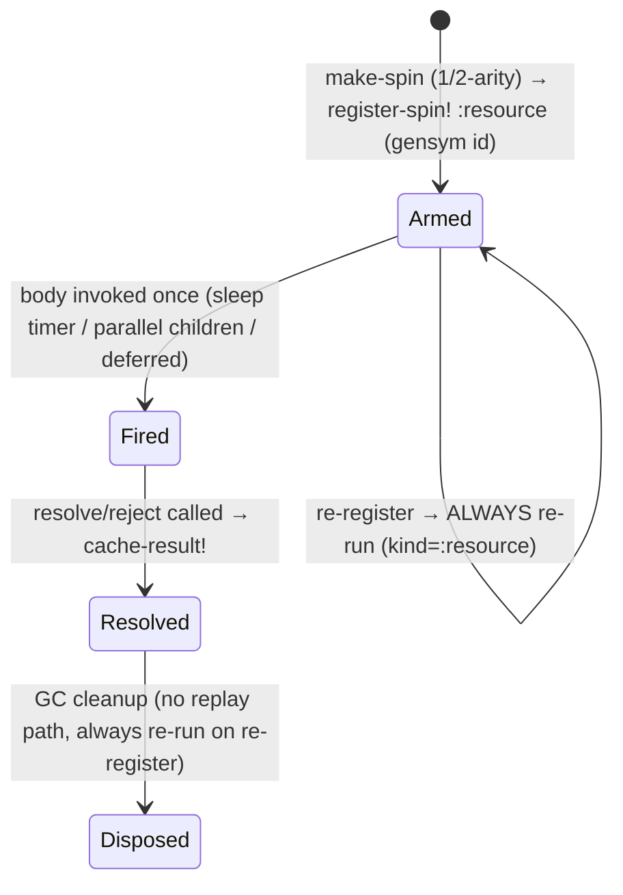
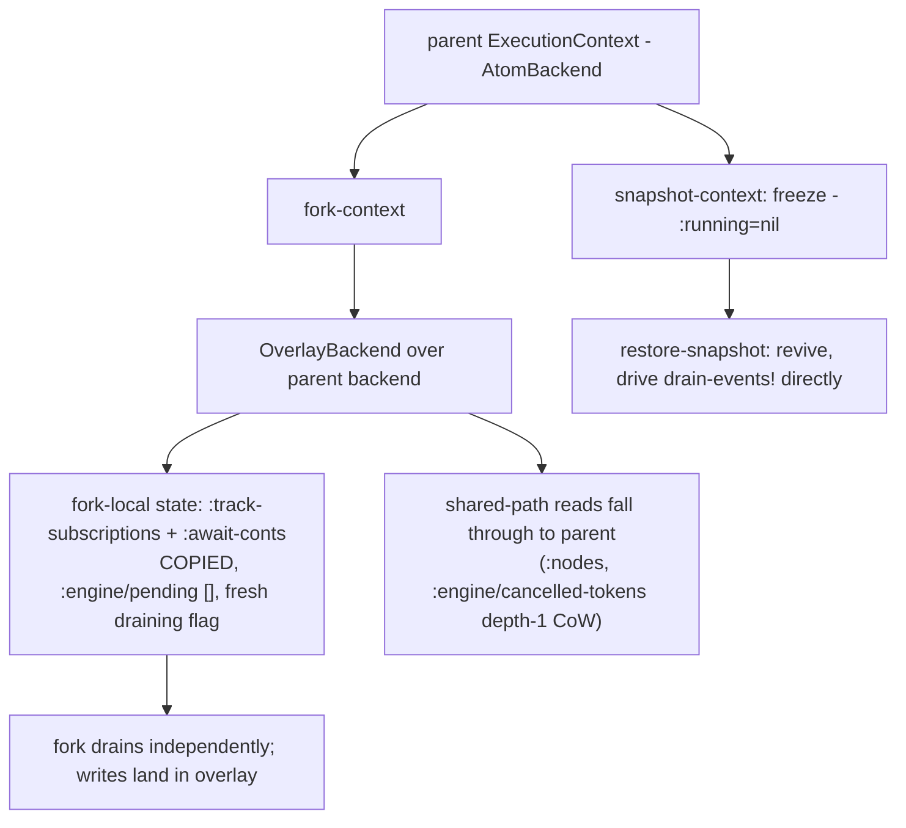

# Spindel Engine Formalism

A formal account of the spindel reactive engine: its algebraic
properties, flow-chart diagrams, and a correctness argument per
reactive composition.

This doc does not re-explain the model — [`concepts.md`](concepts.md)
teaches signals, spins, `track`/`await`, checkpoints, and the drain
queue, and [`engine.md`](engine.md) covers the implementation (state
shape, addressing, CPS/trampoline, executors, overlay backend). This
doc *formalizes* what those teach: every claim is stated as a law and
classified **Holds** (with the enforcing code), **Conjectured**
(plausible but not enforced/tested), or scoped/fragile (with the
boundary noted). Citations are `file:line` against the source tree.

---

## Part 1 — Algebraic Properties

### 1.1 `track` as a comonad

**Claim.** `track` exposes a comonadic structure: the value it delivers
is an `Interval` `(old, new, deltas)` — a *context-carrying* value, not
a bare value. The comonad is "a value in the context of its own
history."

Mapping to comonad operations:

* `extract : W a → a` is `@interval` / `(:new interval)` — discard the
  context, take the current value (`interval.cljc:97-98`).
* `duplicate : W a → W (W a)` corresponds to re-tracking: the body
  re-runs and `track` again delivers an interval, whose `old` is the
  previous `new`. The persistence of the track continuation
  (`:kind :track`, never reaped — `clear-all-await-continuations!` only
  reaps `:await-once`/`:external-await`, `engine/impl/simple.cljc:1597-1600`)
  is what makes the comonadic *co-bind* well-defined: the body is a
  co-Kleisli arrow `W a → b` that the engine re-invokes on each new
  context.

**Counit / identity law** — `extract ∘ duplicate = id`. The first
`track` call returns `(iv/->Interval old snapshot deltas)` synchronously
(`effects/track.cljc:197`); `@` of it yields `snapshot`, the live value.
**Holds** structurally.

**Comonad coherence across re-runs.** On a signal change the engine
resumes the *earliest* track cont and truncates later ones
(`truncate-stale-conts!`, `engine/impl/simple.cljc:329-361`); the body
slice re-runs from that track point with `:slice-state` restored. The
"context" delivered on resume comes from `:on-resume` →
`get-track-value-if-newer` (`effects/track.cljc:71-103`), which honours
generation so a stale resume delivers `deltas = nil` rather than
replaying consumed deltas. **Holds**, modulo the generation caveat
in 1.7.

**Status: Holds (structural).** The comonad laws are not mechanized;
the structure is real and the engine's persistence + interval delivery
realize it. Conjectured: a full categorical proof would need
`track` to be referentially transparent in its argument, which it is
(it dispatches solely on `SignalRef` identity, `effects/track.cljc:209-212`).

### 1.2 `await` as a monad

**Claim.** `await` is monadic sequencing over `Result`. The CPS
transform makes a spin body a sequence of `await`-bind steps; each
`await` is `>>= : M a → (a → M b) → M b` where the continuation is the
`a → M b` arrow.

* **Return** — a spin that resolves synchronously is `return v`: the
  body invokes `resolve` directly (`spin/core.cljc:311-342`).
* **Bind** — `await child` suspends the parent; when `child` completes,
  `:resume-fn` pattern-matches the child's `Result` and routes `:ok`
  payload to the cont's `:resolve-fn`, `:error` payload to `:reject-fn`
  (`effects/await.cljc:129-132`). This is the Either/Result monad's
  bind: errors short-circuit.

**Left identity** — `return a >>= f = f a`. An `await` of an
already-completed child takes the fast path and resumes inline with the
cached value (`effects/await.cljc:165-190`). **Holds.**

**Right identity** — `m >>= return = m`. A spin body whose last form is
`(await child)` resolves with the child's value unchanged (the outer
`resolve` is called with the child payload). **Holds.**

**Associativity** — `(m >>= f) >>= g = m >>= (λx. f x >>= g)`. CPS
nesting is associative by construction: `ioc/invert`
(`spin/cps.cljc:136`) produces a right-nested continuation chain
regardless of how `await`s are grouped in source. **Holds (structural).**

**Error short-circuit** — the Result monad's defining property. A child
`:error` routes to `:reject-fn` → `abort-spin-chain!`
(`spin/core.cljc:345-381`, `:524-546`), which caches the error and
marks observers dirty so they rediscover it. **Holds.**

**Status: Holds (structural).** Not mechanized; CPS construction
guarantees the monad laws the way any CPS encoding of a monad does.

### 1.3 The typed delta algebra laws

Each algebra is a monoid `(D, ·, id)` with `-apply-deltas`,
`-compose-deltas`, `-empty-deltas` (`incremental/algebra.cljc:42-63`),
subject to three laws (stated `algebra.cljc:13-17`).

**Identity** — `apply(t, id) = t`.
* `ScalarAlgebra` — `id = ::no-change`; `-apply-deltas` returns `old`
  unchanged for it (`algebra.cljc:186-188`). **Holds.**
* `SequenceAlgebra` — `id = (empty-diff size)` (all-zero/empty fields,
  `sequence_algebra.cljc:70-74`); `apply-pipeline` of an empty diff is a
  grow-0/shrink-0/identity-perm/empty-change no-op
  (`sequence_algebra.cljc:91-114`). **Holds.**
* `MapAlgebra` — `id = {:assoc {} :dissoc #{} :update {}}`;
  `apply-pipeline` over empty fields is identity. **Holds.**

**Application homomorphism** — `apply(t, d₁·d₂) = apply(apply(t,d₁), d₂)`.
* Scalar — last-write-wins compose; `apply(apply(t,d1),d2)` and
  `apply(t,d2)` agree because compose returns `d2` unless `d2` is
  no-change (`algebra.cljc:193-198`). **Holds.**
* Sequence — `compose-pair` (`sequence_algebra.cljc:136-172`) is
  carefully built so the composed diff reproduces the two-step effect;
  the namespace docstring states this and a property test is referenced
  (`algebra.cljc` and `sequence_algebra.cljc:38-48`). **Holds**
  (conjectured complete; relies on the property test).
* Map — `compose` recurses one level into inner algebras
  (`map_algebra.cljc:37-44`). **Holds** for one nesting level. Scope
  boundary: sequence-nested `lift`/`lower` is deferred
  (`algebra.cljc:259-264`) — the `:change` field has no
  `(:nested algebra delta)` variant yet, so the homomorphism is
  **not claimed** for sequence-nested paths.

**Associativity of `compose`** — `(d₁·d₂)·d₃ = d₁·(d₂·d₃)`.
* Scalar — trivially associative (last-write-wins). **Holds.**
* Sequence — permutations form a group, the other fields are additive
  monoids; `sequence_algebra.cljc:36-48` claims the quotient monoid is
  associative. **Holds (conjectured, property-tested).**
* Map — per-key folding; associative because each field's merge is
  associative. **Holds (conjectured).**
* `compose-deltas` variadic left-folds (`algebra.cljc:118-125`); the
  fold is well-defined *iff* the binary op is associative.

**`nil` vs `[]` contract.** `nil` = uncertainty, `[]` = verified
no-change (`interval.cljc:30-49`). `no-change?` checks *both*
`old = new` *and* the delta being the algebra's identity
(`interval.cljc:186-219`). **Holds** where producers obey it — fragile
because it is a *convention*, not a type: nothing prevents a combinator
from emitting `nil` when it could emit `[]`. The docstring explicitly
warns "Combinators MUST NOT conflate them via `(seq deltas)` alone."

**Size-composability invariant (Sequence).** `-compose-deltas` throws
if `size-after(d1) ≠ size-before(d2)` (`sequence_algebra.cljc:395-401`).
This makes the sequence algebra a *partial* monoid — composition is
defined only for size-compatible pairs. **Holds** (enforced by throw);
worth noting it is not a total monoid.

### 1.4 Glitch-freedom

**Law.** Within one drain, a spin re-runs *at most once per generation*,
and observers run after their dependencies (topological order). This
law is **scoped to the synchronous sub-graph** — see the async caveat.

* **Topological dispatch.** `:signal-change` resolves observers via
  `rtp/ordered-observers` → `topological-sort` (Kahn's algorithm,
  `engine/impl/graph.cljc:30-81`) over the transitive observer closure.
  **Holds** for the synchronous portion of the graph.
* **Descendant filtering.** `compute-descendant-observers`
  (`engine/impl/simple.cljc:448-461`) removes observers that will be
  re-created by a parent observer, preventing them from firing
  independently. **Holds.**
* **Escalation.** `find-root-await-ancestor` escalates a child observer
  to its root await-ancestor so child-fires-then-parent-refires
  double-execution is avoided (`engine/impl/simple.cljc:463-490`,
  `:561-588`). **Holds.**
* **Per-generation dedup.** `:spin-completion` keys `[parent child
  generation]` in `(:resumed-conts batch)` and skips an already-resumed
  triple (`engine/impl/simple.cljc:653-679`). Track deltas are deduped
  per-observer by `:consumed-generation` (1.7).
* **Async caveat.** The docstring at `engine/impl/simple.cljc:511-526`
  is explicit: glitch-freedom holds only within the **synchronous**
  portion. A body suspended on a `:deferred-delivery` / `:mailbox-post`
  resolves in a *later* drain pass — async branches are only
  **eventually consistent**. A diamond where one arm is async and one
  is sync *can* transiently show a glitch (the sync arm updates, the
  async arm lags). This is a deliberate design boundary, not a bug, but
  it means the law is **scoped**, not absolute.

**Status: Holds for the synchronous sub-graph; explicitly scoped (not a
global law) across async boundaries.**

### 1.5 Determinism / replay

**Law.** Re-executing the same code path produces the same spin ids,
hence cache hits land on the same nodes — enabling fork/restore.

* **Computation spins** — ids minted by `next-address!` from
  `(source-loc, chain-head)` (`addressing.cljc:133-155`). The chain-head
  is **per-spin**, seeded at body start with `body-start-chain-head`
  (`addressing.cljc:74-87`) and restored at resume from
  `:slice-state :chain-head`. The same call sequence in the same body
  produces the same id sequence. **Holds.**
* **The computation-vs-resource split is the replay-membership rule.**
  Only `:computation` spins are in the replay set: their ids are
  deterministic and `register-spin!` can serve cached results under
  rebuild. `:resource` spins get gensym ids (`spin/core.cljc:428`) and
  are *not* replayable — `register-spin!` always re-runs them
  (`engine/impl/simple.cljc:1493`). This is correct: a `sleep`/`mailbox`
  body is effectful and one-shot; replaying it would re-arm the timer.
  **Holds.**
* **Rebuild mode** — `Spin` invoke Case 1a (`spin/core.cljc:231-253`)
  executes the body for side effects (re-creating nested spins,
  re-registering conts) while returning the cached value. Relies on the
  per-spin chain-head being re-seeded (`spin/core.cljc:240`). **Holds.**
* **Usage contract** — determinism depends on the body being a pure
  function of its captures and source location. A body that mints spins
  inside a data-dependent loop without `with-key` (`addressing.cljc:194-216`)
  will produce *colliding* ids across iterations. The engine does not
  detect this; it is a usage contract.

**Status: Holds; the kind split makes the replay set precisely the
content-addressed spins.**

### 1.6 The B-gate (idempotence of re-registration)

**Law.** Re-registering a `:computation` spin re-runs its body **iff**
its captured environment changed; otherwise re-registration is a no-op
on cache validity (idempotent).

`register-spin!` (`engine/impl/simple.cljc:1476-1501`): on
re-registration of an *existing* node, it re-runs (marks
`{:completed? false}` + dirty) when

```
(or (= kind :resource)
    (captures-changed? old-captures new-captures))
```

`captures-changed?` (`engine/impl/simple.cljc:1441-1452`) returns true
if the key set differs *or* any value is not `identical?` to its prior.

* **Idempotence** — re-registering with `identical?` captures leaves the
  node `:clean` and `:completed?` true: `await`/`@spin` serve the cache.
  **Holds.**
* **`identical?` not `=`** — O(1), never throws; Clojure structural
  sharing keeps unchanged persistent values `identical?`. The cost is an
  occasional needless re-run when a value is rebuilt `=`-equal but not
  `identical?`. This makes the gate a **sound over-approximation**: it
  may re-run when it didn't need to, but it never *skips* a re-run that
  was needed. **Holds (conservative).**
* **`:resource` always re-runs** — correct, since resource bodies are
  effectful (1.5).
* **First registration** — new node, records captures, no re-run gate
  applies. **Holds.**

This is the formal content of the `stale_lexical_scope_test` regression
(`test/.../stale_lexical_scope_test.cljc`): a nested `(spin …)` form
re-evaluated by a re-running parent yields a *fresh closure*; the B-gate
re-runs it iff its captured environment actually changed.

**Status: Holds; sound conservative idempotence.**

### 1.7 Per-observer delta-once delivery

**Law.** Each observer of a signal sees each generation's deltas
*exactly once*.

A track cont captures the signal's `:generation` at registration as
`:consumed-generation` (`effects/track.cljc:128-129`, `:182-186`). On
resume, `get-track-value-if-newer` returns deltas only if
`current-generation > consumed-generation`, else delivers
`(Interval new new nil)` (`effects/track.cljc:71-103`).

**Open edge case.** The `:consumed-generation` is captured once at cont
*creation* and is **not advanced** when the cont fires.
`get-track-value-if-newer` compares against the *original* captured
generation. On resume the body slice re-runs and `track` is called
again, creating a *new* cont with the *then-current* generation — so in
the normal track-resume path the consumed generation does advance via
cont replacement. But the persistent track cont kept by
`truncate-stale-conts!` for `:order`-less conts is re-tracked via
`track-signal-dep!`, and that re-track does *not* refresh
`:consumed-generation`. **Conjectured latent issue:** a spin tracking
signals A and B, resumed on B, keeps A's cont with A's *old*
consumed-generation; if the body slice that re-tracks A is the
*truncate* re-track (not a body re-run), the generation is stale. The
`multi_track_observer_test` pins the *observer-set* survival but does
**not** assert delta-once for the kept cont.

**Status: Holds for the common path; conjectured edge case around
truncate-re-tracked conts — a targeted test is recommended.**

### 1.8 Commutativity of independent signal changes

**Law.** Two signal changes to *independent* sub-graphs produce the same
final state regardless of order.

Each `:signal-change` is processed as its own event with its own batch
(`engine/impl/simple.cljc:532-535`); FIFO ordering of the queue means
two enqueued signal changes drain sequentially. For *disjoint* observer
sets the two drains touch disjoint nodes, so the result is
order-independent. **Holds (conjectured)** — not mechanized, but follows
from disjointness + the per-event batch isolation.

For *overlapping* sub-graphs order matters and the engine makes no
commutativity claim — last-write-wins on the shared spin's cache. The
`batch` macro (`signal.cljc:21-55`) coalesces multiple swaps into one
`:signal-change` *per distinct signal* in insertion order, which is a
determinism aid, not a commutativity guarantee.

### 1.9 Resume idempotence

**Law.** `resume-body!` applied to the same `(spin, cont)` is safe to
attempt more than once without double-executing side effects.

`resume-body!` (`engine/impl/simple.cljc:411-…`) itself is not
idempotent — it unconditionally re-runs the body slice. Idempotence is
provided by the layers around it:

* **`:spin-completion` dedup** — `[parent child generation]` triple
  guard prevents a second resume of the same await cont in one batch
  (`engine/impl/simple.cljc:653-679`).
* **Cancellation gate** — for external-await, `truncate-stale-conts!`
  fires `:cancel!` before dissociating a stale cont
  (`engine/impl/simple.cljc:355-356`); the orphaned external closure
  then no-ops via `cancellable-external-pair`'s gate
  (`effects/await.cljc:322-463`). This is precisely the
  `cont_cancellation_test` regression: a deferred's `:pending` holds
  *both* the orphaned and the new resolve closure; only the new one
  advances. **Holds.**
* **`try-claim-execution!`** — atomic cache+running check prevents two
  `:spin-execution` events from both running a cold body
  (`engine/impl/simple.cljc:1852-1899`). **Holds.**

**Status: Holds — idempotence is enforced by dedup + cancellation gate +
claim, not by `resume-body!` itself.** `resume-body!` is the *one*
resume path, taking a single `mode ∈ {:track :await}` argument. The
mode is a `case` with no `:else`, so an illegal mode throws rather than
silently mis-resuming; the per-mode data (`:signal-id` to re-track for
`:track`, `:resume-fn` for `:await`) is carried by the continuation
itself.

---

## Part 2 — Flow-Chart Formalism

### 2.1 The drain cycle



### 2.2 Signal-change propagation



### 2.3 The await-cascade



### 2.4 Track-resume (comonad) vs await-resume (monad)



The two columns are exactly the comonad/monad distinction, and the
`mode` argument names which one. A `:track` resume *re-runs* (comonadic
co-bind: re-invoke the co-Kleisli arrow on a new context); an `:await`
resume *advances* (monadic bind: feed the bound value into the rest).
`resume-body!` derives all the per-mode behavior from `mode` — the four
behaviors are not a 4-tuple of caller-supplied flags.

### 2.5 Computation-spin lifecycle



### 2.6 Resource-spin lifecycle



### 2.7 Fork / restore



---

## Part 3 — Correctness per Reactive Composition

For each composition: the **invariant** that must hold, and the
**argument** the engine preserves it (or where it is fragile).

### 3.1 Nested spins (spin-in-spin)

**Invariant.** A `(spin …)` form lexically inside another spin's body,
re-evaluated when the parent re-runs, must observe its *current* captured
lexical scope — no stale closure.

**Argument.** The parent re-run re-evaluates the inner `(spin …)` form,
producing a fresh `cps-fn` closure over the new locals and a fresh
`:captured-locals` map. `register-spin!`'s B-gate
(`engine/impl/simple.cljc:1489-1497`) compares `:captured-locals` with
`identical?` and re-runs the inner spin iff a capture changed. The
inner spin's id is *stable* across parent re-runs (per-spin chain-head
re-seeded at parent body start, `addressing.cljc:121-127`), so the
re-evaluation lands on the *same* SpinNode — re-registration, not a new
node. **Holds** — this is the `stale_lexical_scope_test` /
`nested_spin_invalidation_test` regression, fixed by the B-gate.

### 3.2 `track` inside a re-running spin

**Invariant.** Each `track` call re-registers a persistent cont; the
spin remains an observer of every signal it tracks, across re-runs.

**Argument.** `track-signal-dep!` eagerly registers the observer at
*track time* (`engine/impl/simple.cljc:1335-1384`). On a body re-run the
new track call re-registers; `record-deps!` at body completion prunes
only signals tracked *last* run but *not this* run
(`engine/impl/simple.cljc:1063-1084`). **Fragile point — see 1.7 and
3.4:** the `:slice-state :tracking` snapshot must include the
just-tracked signal, else `record-deps!` would commit deps missing it
(`effects/track.cljc:146-159` documents this fix; `multi_track_observer_test`
is the regression). **Holds post-fix.**

### 3.3 `await` inside a spin (await-cascade)

**Invariant.** When an awaited child completes, the parent resumes
exactly once per completion, with the child's Result correctly routed
(`:ok`→value, `:error`→propagated).

**Argument.** `:spin-completion` dispatch resumes the parent's await
cont via `resume-body!` in `:await` mode, the cont's `:resume-fn` doing
the monadic match (`effects/await.cljc:129-132`). The
`[parent child generation]` dedup prevents a double resume in one batch.
`:await` mode does no truncation, no dirty/running re-mark, and no
`:created-spins` clear, because it *advances* a still-suspended body
rather than re-running it — wiping `:created-spins` would drop the
awaited child itself. **Holds.**

### 3.4 `track` + `await` in one body (continuation `:order` truncation)

**Invariant.** A body `(track A) … (await X) …`: if A changes while
suspended on X, the body re-runs from the `track A` point and the stale
`await X` cont must be cancelled so X's eventual completion does *not*
also advance the orphaned slice.

**Argument.** `truncate-stale-conts!` drops every cont with
`:order` > the resumed track cont, firing `:cancel!` first
(`engine/impl/simple.cljc:329-361`). For external resources the
cancellation gate (`cancellable-external-pair`) makes the orphaned
closure a no-op (`effects/await.cljc:322-463`). For a child Spin await,
the truncated cont simply ceases to exist, so the child's
`:spin-completion` finds no subscriber for the old cont. The
re-running body re-issues a fresh `await X` cont. **Holds** — this is
the `cont_cancellation_test` suite (deferred, mailbox, fork-isolation).

**Open subtlety.** Conts with `:order` *less* than the resumed one are
*kept* and their signal deps re-tracked (`engine/impl/simple.cljc:357-361`)
— but `truncate-stale-conts!` re-tracks via `track-signal-dep!`, which
does **not** refresh `:consumed-generation`. See 1.7 — flagged.

### 3.5 Sibling spins

**Invariant.** Two spins observing the same signal both re-run on a
change, in topological order, each at most once.

**Argument.** `ordered-observers` returns both in a Kahn topological
order (`engine/impl/graph.cljc:63-81`); the JVM path may resume
*independent* observers in parallel on the executor with a
`CountDownLatch` join (`engine/impl/simple.cljc:603-623`) — safe because
each resume is atomic `swap-state!` on its *own* node. CLJS is always
sequential. **Holds.**

### 3.6 `parallel` / `race`

**Invariant (parallel).** Completes when all children complete; result
is the vector of child results; reactive — re-fires when a child
re-completes.

**Argument.** `parallel` is a `:resource` spin
(`spin/combinators.cljc:66-163`). It registers an `:await-reactive`
cont per child (`combinators.cljc:111-141`) so a child's later
re-completion re-caches `parallel`'s result and enqueues a fresh
`:spin-completion`. Fail-fast: first child error cancels siblings
(`combinators.cljc:145-151`). **Holds.** *Fragile:* coordination atoms
`completed`/`done?` are local closures, *not* in context state — the
docstring admits they are "write-once, not forked"
(`combinators.cljc:63-64`). A fork of a context with an in-flight
`parallel` shares those atoms — correct only because they are write-once.

**Invariant (race).** Completes with the first child; losers cancelled.
**Argument.** `compare-and-set!` on `done?` picks the winner
(`combinators.cljc:246-265`); cancellation errors from losers are
swallowed. **Holds.**

### 3.7 `debounce` / `throttle` / `sample`

**Invariant.** Rate-control combinators delay / coalesce value delivery
without losing the *final* value.

**Argument.** Each is a `:computation` spin composing a `:resource`
`sleep` then an `await` of the source (`combinators.cljc:300-353`).
When the source signal changes, the *computation* spin re-runs from the
top (it tracks the source transitively), restarting the `sleep` — that
is the debounce timer reset. **Holds for value delivery.** *Scope:*
the namespace docstrings note rate control "may lose intermediate
deltas" unless wrapped in `accumulate` (`combinators.cljc:455-456`) —
i.e. the *delta* history is not preserved by debounce/throttle alone,
only the snapshot. `accumulate` (`combinators.cljc:457-466`) uses a
closure atom that persists across re-runs to merge intervals; its
correctness depends on `merge-fn` being associative (a stated
precondition, `combinators.cljc:425-427`).

### 3.8 Deep nesting under await-cascade

**Invariant.** A → awaits → B → awaits → C: when C completes, the
completion propagates up through B to A, each parent resuming once.

**Argument.** Each completion enqueues its own `:spin-completion`;
`process-event!` resumes the immediate parents, whose own resolution
enqueues the next `:spin-completion` — a cascade through the FIFO queue.
`propagate-await-dirty!` (`engine/impl/simple.cljc:1658-1711`) marks
*completed, non-suspended* ancestors dirty so a re-run reaches stale
caches. **Holds.** *Fragile:* `find-root-await-ancestor`
(`engine/impl/simple.cljc:463-490`) walks `:observers` taking
`(first parents)` — for a spin awaited by *multiple* parents it picks
an arbitrary one as "the" root. Escalation to *one* root is fine when
the await graph is a tree; for a DAG with shared awaited children the
"root" is non-deterministic. Flagged as a latent question.

### Invariant summary table

| composition          | glitch-free | no double-exec | no stale-cache | no orphan cont | deterministic id |
|----------------------|:-----------:|:--------------:|:--------------:|:--------------:|:----------------:|
| nested spins         | ✓           | ✓ (B-gate)     | ✓ (B-gate)     | ✓              | ✓                |
| track in re-run      | ✓           | ✓              | ✓              | ✓ (post-fix)   | ✓                |
| await-cascade        | ✓ (sync)    | ✓ (dedup)      | ✓ (propagate)  | ✓              | ✓                |
| track + await        | ✓           | ✓ (cancel gate)| ⚠ gen-staleness | ✓ (truncate)  | ✓                |
| sibling spins        | ✓           | ✓              | ✓              | ✓              | ✓                |
| parallel / race      | ✓           | ✓ (CAS)        | ✓              | ✓              | ✗ (resource)     |
| debounce/throttle    | ✓           | ✓              | ⚠ deltas lost  | ✓              | ✓ (comp) / ✗ (sleep) |
| deep await nesting   | ✓ (sync)    | ✓              | ✓              | ✓              | ⚠ multi-parent root |
